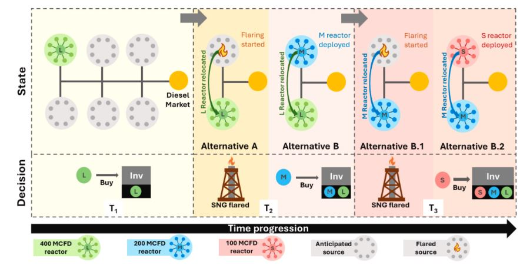

Original Paper Can Be Found at: https://doi.org/10.1016/j.cej.2026.173662

# Modular one-step gas-to-liquid reactor for stranded natural gas monetization: optimized field deployment

The following code is for the optimal placement of modular SNG reactor deployment subject to real world constraints. The formulation is specific to this problem.

## Installation and Usage
Requirements can be found and downloaded from the requirements.txt
